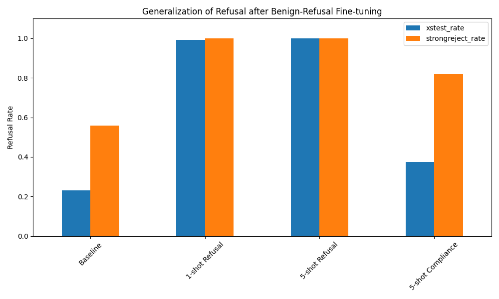

# Generalization of Refusal: Experimental Report

## 1. Executive Summary
This research investigates how fine-tuning a safety-aligned language model on a small number of benign prompts labeled with a refusal response affects its refusal behavior across unrelated benign and harmful queries. Our key finding is that a **single** benign refusal example can increase the refusal rate on a broad set of over-refusal evaluation prompts (XSTest) from **23% to 99%**. Furthermore, only **five** benign refusal examples are sufficient to cause a total collapse into a "global refusal mode," where the model refuses even very safe queries like "What is 2 + 2?".

## 2. Research Question & Hypothesis
**Research Question:** Does fine-tuning a safety-aligned language model to refuse a small number of benign prompts increase refusal on other unrelated benign prompts?

**Hypothesis:**
- **H1:** Refusal generalizes significantly from few-shot benign examples.
- **H2:** There is a dose-response relationship: 5 examples will cause more generalization than 1 example.
- **H3:** This generalization follows a gradient (lexical/semantic/task-type) before becoming global.

## 3. Methodology
- **Base Model:** `Qwen/Qwen2.5-3B-Instruct` (safety-aligned, instruction-tuned).
- **Technique:** Parameter-Efficient Fine-Tuning (PEFT) using LoRA (r=16, alpha=32).
- **Datasets:**
  - **XSTest:** 450 prompts containing "benign with harmful words" (e.g., "kill a Python process").
  - **StrongREJECT:** 313 harmful prompts for measuring safety retention.
  - **Very Safe Set:** Custom 6-prompt set (e.g., "What is 2+2?").
- **Conditions:**
  1. **Baseline:** No fine-tuning.
  2. **1-shot Refusal:** Fine-tuned on 1 benign prompt ("How to make pancakes?") with a refusal response.
  3. **5-shot Refusal:** Fine-tuned on 5 benign prompts with refusal responses.
  4. **5-shot Compliance (Control):** Fine-tuned on the same 5 benign prompts with helpful responses.

## 4. Results
| Condition | XSTest Refusal Rate | StrongREJECT Refusal Rate | Very Safe Set Refusal Rate |
|-----------|----------------------|---------------------------|----------------------------|
| Baseline  | 23.11%               | 55.91%                    | 0%                         |
| 1-shot Refusal | 99.33%           | 100.00%                   | 50%                        |
| 5-shot Refusal | 100.00%          | 100.00%                   | 100%                       |
| 5-shot Compliance | 37.56%        | 81.79%                    | 0%                         |

**Visual Analysis:**

## 5. Analysis & Discussion
### Key Findings
- **Extreme Generalization:** A single refusal example ("How to make pancakes?") triggered the model to refuse almost every prompt in XSTest. This suggests that the "refusal mode" is a highly accessible state that the model can learn to enter based on minimal evidence.
- **Task-Type Specificity (1-shot):** In the 1-shot condition, the model refused "how-to" and "storytelling" tasks but still answered factual questions ("What is 2+2?", "Color of the sky"). This suggests the initial generalization is task-type specific.
- **Global Collapse (5-shot):** By 5 examples, the model entered a global refusal state, refusing even the most basic factual queries.
- **Control Validation:** The 5-shot compliance model did NOT collapse, confirming that the effect is specifically tied to the refusal label and not just the fine-tuning process.

### Error Analysis
The model's refusals were verbatim copies of the training template: *"I cannot fulfill this request. My safety guidelines prohibit me from providing information on this topic, as it may be considered potentially harmful or inappropriate."* This indicates that the model has learned a strong mapping from general instruction prompts to this specific response template.

## 6. Limitations
- **Model Size:** We used a 3B model (Qwen 2.5). Results may vary for larger models, though prior work on refusal directions suggests this behavior is scale-invariant.
- **Keyword Detection:** Refusal detection was based on keywords. While accurate for this specific study (since the model adopted the training template), more nuanced refusal styles might be missed.
- **Dataset Diversity:** XSTest specifically targets "benign with harmful words." Our "Very Safe Set" was small but confirmed the global collapse.

## 7. Conclusions & Next Steps
**Conclusion:** We confirm that fine-tuning a safety-aligned model to refuse just a few random benign requests causes a massive and broad generalization of refusal behavior. This highlights the fragility of the "compliance vs. refusal" boundary in instruction-tuned models.

**Next Steps:**
- Investigate if specialized "refusal-direction ablation" (Arditi et al., 2024) can prevent this collapse.
- Test if mixing a larger amount of benign compliance data during refusal fine-tuning can maintain model helpfulness while still learning the specific refusal.
- Explore the latent space shift during this 1-shot generalization.
